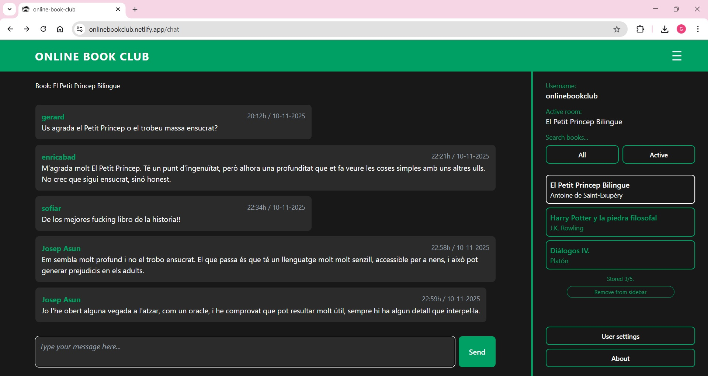
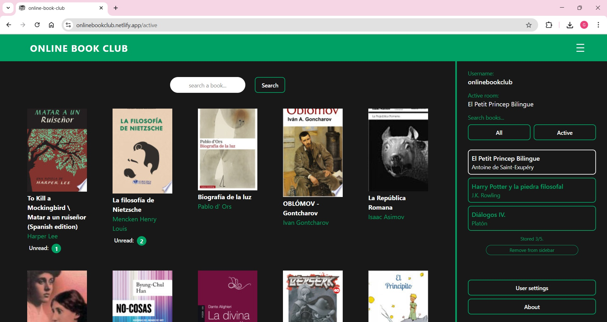
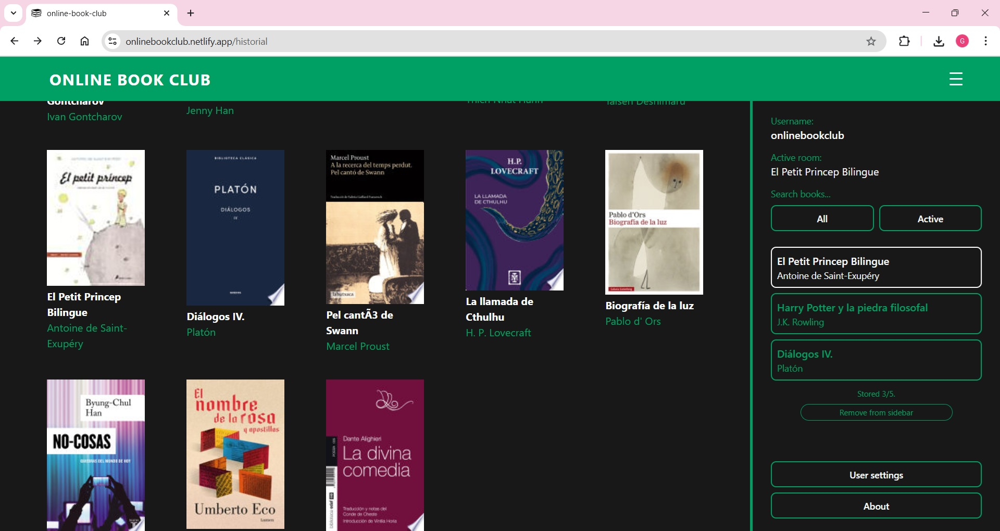
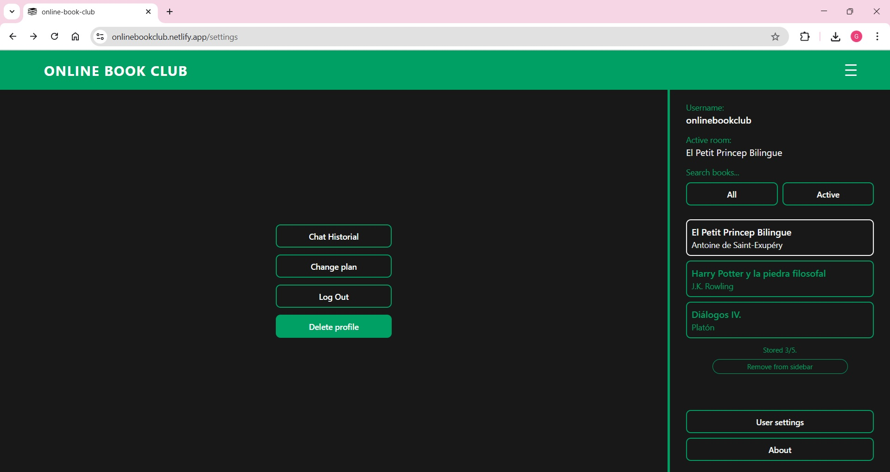
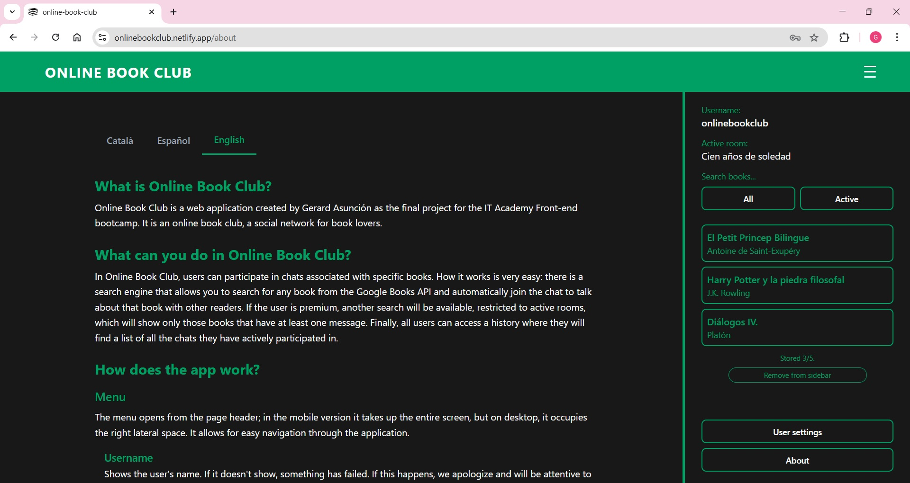

# ONLINE BOOK CLUB / 2025-S9 Academic Practice

## 📚 Índex / Table of Contents

1. [Sobre el projecte / About](#1-sobre-el-projecte--about)
2. [Funcionalitats / Features](#2-funcionalitats--features)
3. [Tecnologia / Tech Stack](#3-tecnologia--tech-stack)
4. [Demo en línia / Live Demo](#4-demo-en-línia--live-demo)
5. [Repositori / Front](#5-repositori--repository)
6. [Instal·lació / Installation](#6-instal·lació--installation)
7. [Testing](#7-testing)
8. [Estructura / Structure](#8-estructura--structure)
9. [Captures / Screenshots](#9-captures--screenshots)
10. [Estat del Projecte i Continuïtat / Project Status and Future Plans](#10-estat-del-projecte-i-pontinuïtat--project-status-and-future-plans)

## 1. Sobre el projecte / About

**CAT:**

`Online Book Club` és una aplicació web que permet als usuaris participar de xats on es parla de llibres. És, com el seu nom indica, un **club de lectura en línia**. El funcionament és senzill, hi ha un cercador de llibres que utilitza la API de Google Books, quan l'usuari selecciona un llibre, obre un xat que tracta sobre aquell llibre. També hi ha una pàgina que mostra automàticament tots els llibres que tenen xats actius, i inclou un cercador. A més, cada usuari té un historial de xats on ha participat, i pot desar fins a 5 xats a la barra lateral, facilitant-ne l'accés. Ara mateix, hi ha una versió d'usuari standard i una premium, encara que és una funcionalitat experimental i l'usuari pot canviar d'una a l'altra fàcilment sense cap cost. Algunes de les característiques esmentades només les tenen els usuaris premium.

El frontend està desenvolupat amb `React` i `TypeScript` sobre `Vite`, amb un ús especial de `Redux Toolkit` i `Redux Persist`, gestionant algunes dades amb el **local storage** de manera eficient. L'inci de sessió es manté actiu fins que l'usuari decideix tancar sessió manualment desde la pròpia aplicaicó, gràcies a una simple gestió de **cookies** amb la llibreria `universal cookie`.

En quant al backend, s'ha gestionat completament amb `Firebase`. Concretament, `Firebase Authentication` per a gestionar el registre d'usuaris, l'inci de sessió, tancar sessió i eliminar el compte. A més, el codi obté d'aquí la **Uid** de l'usuari i el seu nom o **displayedName**. En quant a la base de dades, hem utilitzat `Firestore Database`, que ens ha permès crear el xat i la notificació de missatges sense llegir, consultant dades en temps real. A `Firestore Database` hem creat tres col·leccions: la de **missatges**, la d'**usuaris** i una de **noms d'usuari**, que és exclusivament per a comprovar la disponibilitat del nom que algú vol registrar, abans de registrar-lo.

També hem utilitzat `Sentry` per a gestionar els missatges d'error.

El projecte està **deployat** a `Netlify`. La url és: [https://onlinebookclub.netlify.app/](https://onlinebookclub.netlify.app/)

**EN:**

`Online Book Club` is a web application that allows users to participate in chats where they discuss books. It is, as the name suggests, an **online book club**. The functionality is simple: there is a book search engine that uses the Google Books API. When the user selects a book, it opens a chat dedicated to that specific book. There is also a page that automatically displays all books with active chats, and it includes a search feature. Additionally, every user has a chat history showing their participation, and they can save up to 5 chats to the sidebar, making them easily accessible. Currently, there is a standard user version and a premium version, although this is an experimental functionality, and the user can switch from one to the other easily at no cost. Some of the mentioned features are exclusive to premium users.

The frontend is developed using `React` and `TypeScript` on top of `Vite`, with a special use of `Redux Toolkit` and `Redux Persist`, efficiently managing some data with **local storage**. The session remains active until the user decides to manually log out from within the application itself, thanks to a simple management of **cookies** using the `universal-cookie` library.

Regarding the backend, it is managed entirely with `Firebase`. Specifically, `Firebase Authentication` is used to handle user registration, logging in, logging out, and deleting the account. Furthermore, the code retrieves the user's **Uid** and their name or **displayedName** from here. For the database, we have used `Firestore Database`, which has allowed us to create the chat and the unread message notification feature, querying data in real-time. In `Firestore Database`, we have created three collections: **messages**, **users**, and **usernames**, the latter being exclusively for checking the availability of a name someone wishes to register, prior to registration.

We have also used `Sentry` to manage error messages.

The project is **deployed** on `Netlify`. The URL is: [https://onlinebookclub.netlify.app/](https://onlinebookclub.netlify.app/)

## 2. Funcionalitats / Features

* ✅ **Gestió d'usuaris (CRUD):** Creació, lectura, actualització i eliminació d'usuaris amb diferents rols.
* ✅ **Xat Interactiu:** Un xat que es comunica en temps real amb `Firestore Database` per a enviar i rebre missatges.
* ✅ **Cercador de llibres:** Cerca fàcil i intuitiva de llibres, amb la possibilitat d'obrir o crear un xat sobre aquell llibre amb un sol click.
* ✅ **Recuperació de xats:** És fàcil recuperar els xats on l'usuari ha participat, o trobar tots els xats actius.
* ✅ **Notificació de missatges sense llegir:** L'usuari és notificat en temps real i de manera automàtica si algun dels xats que té missatges que no ha llegit.

## 3. Tecnologia / Tech Stack

* **React**
* **Vite**
* **Redux Toolkit**
* **Redux Persist**
* **Tailwind CSS**
* **TypeScript**
* **React Router Dom**
* **Axios**
* **Universal Cookie**
* **Git & GitHub**
* **Firebase Authentication**
* **Firestore Database**
* **Sentry**
* **Sonar Qube**
* **Netlify**

## 4. Demo en línia / Live Demo

**Live:** 👉 [https://onlinebookclub.netlify.app/](https://onlinebookclub.netlify.app/)

**CAT:**
Visita la demo en línia per veure l’aplicació en funcionament.

**EN:**
Check out the live demo to see the application in action.

## 5. Repositori / repository

**Github:** 👉 https://github.com/gerard-asuncion/online-book-club.git ---


## 6. Instal·lació / Installation

**CAT:**

_Segueix aquests passos per clonar el projecte i fer servir el compilador Vite per obrir el projecte en mode de desenvolupament local._

**EN:**

_Follow these steps to clone the project and use the Vite compiler to open the project in local developer mode._

**Requeriments / Prerequisites**

-   Node.js
-   npm

### 1. Clonar el repositori / Clone the repository

```bash
git clone [https://github.com/gerard-asuncion/online-book-club.git](https://github.com/gerard-asuncion/online-book-club.git)
```

### 2. Entrar al directori del projecte / Navigate into the project directory

```bash
cd online-book-club
```

### 3. Instal·lar dependències / Install dependencies

```bash
npm install
```
### 4. Crear arxiu d'entorn / Create environment file

Crea un arxiu `.env` a l'arrel del projecte i afegeix les variables necessàries, basant-te en l'arxiu .env.example.

Google Books no proveeix cap clau o token, és suficient amb la url:

```
VITE_GOOGLE_BOOKS_API_URL=https://www.googleapis.com/books/v1/volumes
```

### 5. Executar el projecte en mode desenvolupament / Run the project in development mode
```bash
npm run dev
```

### 6. Obre el servidor local de Vite / Open the local Vite server

http://localhost:5173

## 7. Testing

**CAT:**

El projecte encara no inclou testing, però aviat en tindrà.

**EN:**

There is no testing yet, 

## 8. Estructura / Structure

```
online-book-club/
├── .env.example
├── .gitignore
├── package.json
├── package-lock.json
├── README.md
├── eslint.config.js
├── index.html
├── tsconfig.json
├── tsconfig.app.json
├── tsconfig.node.json
├── vite.config.ts
├── public/
│   ├── _redirects
│   └── books-icon.svg
└── src/
    ├── App.tsx
    ├── firebase-config.ts
    ├── instrument.ts
    ├── index.css
    ├── main.tsx
    ├── vite.env-d.ts
    ├── app/
    │   ├── hooks.ts
    │   └── store.ts
    ├── classes/
    │   ├── ChatMessage.ts
    │   ├── CustomErrors.ts
    │   ├── LoginError.ts
    │   └── RegisterUser.ts
    ├── components/
    │   ├── form/
    │   │   ├── ActiveBooksGrid.tsx
    │   │   ├── BooksGrid.tsx
    │   │   ├── Chat.tsx
    │   │   ├── ChatHistorial.tsx
    │   │   ├── LoginForm.tsx
    │   │   ├── RedirectIfAuth.tsx
    │   │   ├── RegisterForm.tsx
    │   │   ├── RequireAuth.tsx
    │   │   ├── Settings.tsx
    │   │   └── Sidebar.tsx
    │   └── ui/
    │       ├── AboutSection.tsx
    │       ├── AppLayout.tsx
    │       ├── GridBookCard.tsx
    │       ├── Header.tsx
    │       ├── MainContentFrame.tsx
    │       ├── SidebarBookCard.tsx
    │       └── ScreenFrame.tsx
    ├── data/
    │   └── aboutData.json
    ├── features/
    │   ├── auth/
    │   │   ├── authSelectors.ts
    │   │   └── authSlice.ts
    │   ├── currentBook/
    │   │   ├── currentBookSelectors.ts
    │   │   └── currentBookSlice.ts
    │   ├── displayInfo/
    │   │   ├── displayInfoSelector.ts
    │   │   └── displayInfoSlice.ts
    │   ├── googleBooks/
    │   │   ├── googleBooksSelectors.ts
    │   │   └── googleBooksSlice.ts
    │   ├── responsive/
    │   │   ├── responsiveSelectors.ts
    │   │   └── responsiveSlice.ts
    │   └── userProfile/
    │       ├── userProfileSelectors.ts
    │       └── userProfileSlice.ts
    ├── hooks/
    │   ├── useActiveBooksGrid.ts
    │   ├── useAuth.ts
    │   ├── useBooksGrid.ts
    │   ├── useChat.ts
    │   ├── useChatHistorial.ts
    │   ├── useGridBookCard.ts
    │   ├── usePageNavigation.ts
    │   ├── useResponsive.ts
    │   ├── useSettings.ts
    │   ├── useSidebar.ts
    │   ├── useUnreadCount.ts
    │   └── useUserData.ts
    ├── pages/
    │   ├── AboutPage.tsx
    │   ├── ActiveBooksGridPage.tsx
    │   ├── AppPage.tsx
    │   ├── BooksGridPage.tsx
    │   ├── ChatHistorialPage.tsx
    │   ├── ChatPage.tsx
    │   ├── ErrorPage.tsx
    │   ├── LoadingPage.tsx
    │   ├── LoginPage.tsx
    │   ├── RegisterPage.tsx
    │   └── SettingsPage.tsx
    ├── types/
    │   ├── aboutTypes.ts
    │   ├── booksTypes.ts
    │   ├── messageTypes.ts
    │   ├── props.ts
    │   ├── redux.ts
    │   └── types.ts
    └── utils/
        ├── classNameUtils.ts
        ├── dateUtils.ts
        └── utils.ts

```

## 9. Captures / Screenshots

* **Search (initial page):**


* **Chat:**


* **Active chats:**


* **User's chat historial:**


* **Settings:**


* **About:**



## 10. Estat del Projecte i Continuïtat / Project Status & Future Plans

**CAT:**

`Online Book Club` és un projecte en desenvolupament, que ha començat com a treball final d'un bootcamp de Frontend a la IT Academy de Barcelona. La primera millora que hi ha prevista és implementar **testing**. Tot i així, la **aplicació** ja és funcional i ofereix una experiència d'ús fluida.

**EN:**

`Online Book Club` is a project under development, which started as the final project of a Frontend bootcamp at the IT Academy in Barcelona. The first planned improvement is to implement **testing**. Even so, the *application** is already functional and offers a fluid user experience.